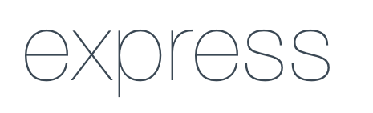
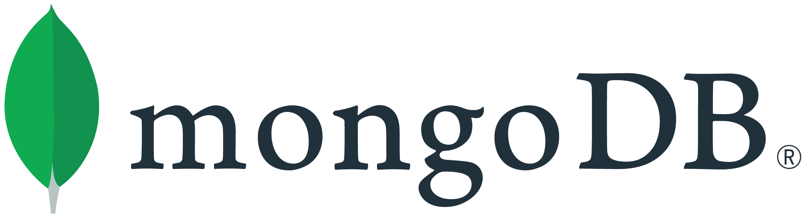
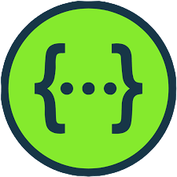

### API for Movie Quotes

Using the API you can do CRUD operations on quotes, movies and application users.

#

## Table of Contents

- [Table of Contents](#table-of-contents)
- [Prerequisites](#prerequisites)
- [Tech Stack](#tech-stack)
- [Getting Started](#getting-started)
- [Project Structure](#project-structure)
- [Resources](#resources)

## Prerequisites

-  <p>_Node JS @12.X and up_</p>
-  <p>_npm @6 and up_</p>

#

## Tech Stack

-  <p><a href="https://nodejs.org/en/" target="_blank">[NodeJS @16.15.1]</a> - JavaScript runtime built on Chrome's V8 JavaScript engine<p/>

-  <p><a href="https://expressjs.com/" target="_blank">[Express @4.18.1]</a> - Fast, unopinionated, minimalist web framework for Node.js<p/>

-  <p><a href="https://www.mongodb.com/" target="_blank">[MongoDB]</a> - Open source NoSQL database management program<p/>

-  <p><a href="https://mongoosejs.com/" target="_blank">[mongoose @6.3.6]</a> - elegant mongodb object modeling for node.js<p/>

-  <p><a href="https://www.typescriptlang.org/" target="_blank">[Typescript @4.7.4]</a> - TypeScript is JavaScript with syntax for types<p/>

-  <p><a href="https://socket.io/" target="_blank">[Socket.IO @4.5.1]</a> - Bidirectional and low-latency communication for every platform<p/>

-  <p><a href="https://www.npmjs.com/package/swagger-ui-express" target="_blank">[Swagger UI Express @4.5.0]</a> - Serve auto-generated swagger-ui generated API docs from express<p/>

-  <p><a href="https://express-validator.github.io/docs/" target="_blank">[express-validator @6.14.2]</a> - express.js middlewares that wraps validator.js validator and sanitizer functions<p/>

-  <p><a href="https://jwt.io/" target="_blank">[jsonwebtoken @8.5.1]</a> - JWT.IO allows you to decode, verify and generate JWT<p/>

-  <p><a href="https://sendgrid.com/" target="_blank">[sendgrid/mail @7.7.0]</a> - Service for interaction with the mail endpoint of the SendGrid v3 API<p/>

- <p>Multer <a href="https://www.npmjs.com/package/multer" target="_blank">[multer @1.4.5-lts.1]</a> - node.js middleware for handling multipart/form-data<p/>

#

## Getting Started

1\. First of all you need to clone repository from github:

```sh
git clone https://github.com/Saba-Var/movie-quotes-api-Var-saba.git
```

2\. Navigate to the repository

```sh
cd movie-quotes-api-Var-saba/
```

3\. Next step requires install all the dependencies

```sh
npm install
```

or

```sh
yarn install
```

4\. Copy .env

```sh
cp .env.example .env
```

5\. If you want you can also change default configuration of .env file and connect to mongodb

```sh

MONGO_DATABASE=movieQuotes
MONGO_PROTOCOL=mongodb
MONGO_HOST=localhost
MONGO_PORT=27017
MONGO_PASSWORD=
MONGO_USER=

SERVER_PORT=4444

FRONTEND_URI=http://localhost:3000
EMAIL_SENDER=sender@gmail.com

SENGRID_API_KEY=sendgrid-api-key
JWT_SECRET=jwt-secret
```

6\. For the first time before run the API run following command:

```sh
npx tsc
```

7\. After that you can run Movie Quotes API from terminal:

```sh
npm run dev
```

To see swagger documentation visit [localhost:4444/api-docs](http://localhost:4444/api-docs)

#

#

## Project Structure

```bash
├─── .github
├─── public
├─── readme
├─── src
│    ├── config
│    ├── controllers
│    ├── middlewares
│    ├── models
│    ├── routes
│    ├── schemas
│    ├── utils
│    └── views
- .env
- .env.example
- .eslintrc.json
- .gitignore
- .prettierrc.json
- babel.config.json
- package-lock.json
- package.json
- README.md
- tsconfig.json


```

#

## Resources

- [Application Details](https://redberry.gitbook.io/assignment-iv-movie-quotes-1/)
- [Git commit rules](https://redberry.gitbook.io/resources/git-is-semantikuri-komitebi)
